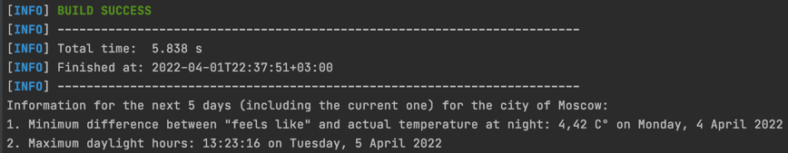
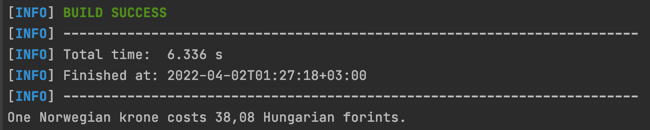

# teamidea_krasov

This project represents solutions for TeamIDEA company test tasks.
### Task 3a:
Develop a program that, based on the service data [openweathermap.org](https://openweathermap.org/) (requires registration, Free plan is enough) will display the following data for your city:
1. Day, with the minimum difference between the "feels like" and actual temperature at night (indicating the difference in degrees Celsius)
2. The maximum duration of daylight hours (calculated as the difference between the time of sunset and sunrise) for the next 5 days (including the current one), indicating the date.

#### Solution:
In fact the given service data [openweathermap.org](https://openweathermap.org/) has an API returning a JSON. So the solution was to parse API's URL and then to take  required information from the received JSON.

#### Build:
To build and start the solution program `cd` the project directory and use command below:

    mvn -Pweather install; java -jar ./target/weather.jar

#### Settings:
All project settings are stored in a file `app.properties`

#### Used technologies:
1. JSOUP for parsing the API's URL
2. JSON Simple for encoding JSON
3. Slf4j for logging

----

### Task 3b:
Develop a program that determines the value of one Norwegian krone in Hungarian forints by converting currencies through rubles at the current exchange rate Russian Central Bank
(Hungarian forint => Russian ruble => Norwegian krone).
Request a course from the website: http://www.cbr.ru/scripts/XML_daily.asp

#### Solution:
To resolve this task it was enough to parse the given URL and compute the required price.

#### Build:
To build and start the solution program `cd` the project directory and use command below:

    mvn -Pexchange install; java -jar ./target/exchange.jar

#### Used technologies:
1. JSOUP for parsing the API URL 
2. Slf4j for logging